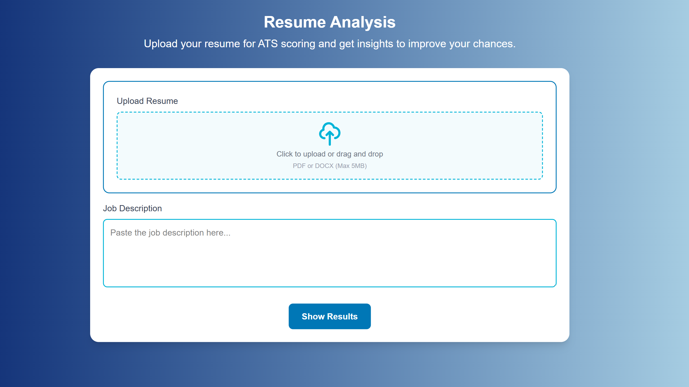
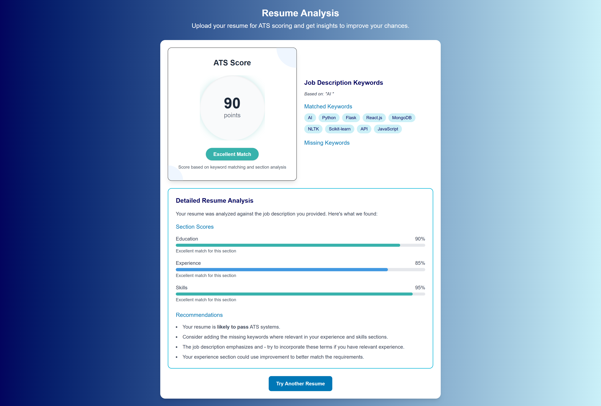

# ATS Resume Checker

A web-based tool that helps job seekers evaluate how well their resume aligns with job descriptions by simulating Applicant Tracking System (ATS) behavior. This tool analyzes keyword match, skills overlap, and overall compatibility between a resume and job listing.

🌐 **Live Site**: [ats-checker.netlify.app](https://ats-checker.netlify.app/)

---

## 🚀 Features

- ✅ Upload resume (PDF or Text format)
- 📝 Paste job description for matching
- 📊 ATS-friendly analysis report
- 🔍 Keyword and skills matching
- 💡 Suggestions to improve resume compatibility

---

## 📸 Demo

The Form:

The Result:

---

## 🛠 Tech Stack

- **Frontend**: Next.js
- **Styling**: TailwindCSS 
- **Backend**: Flask
- **Deployment**: Netlify,Render

---

